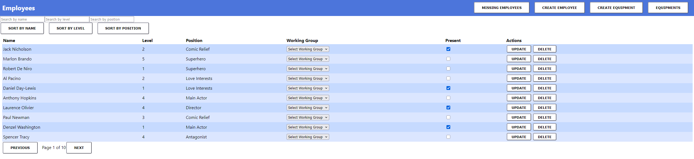

<a id="readme-top"></a>

<br />
<div align="center">
  <a href="https://github.com/SzekelyBoti/Employee-Madness">
    
  </a>

<h3 align="center">🏢 Employee Madness</h3>

  <p align="center">
    A full-stack employee management application with React frontend, Node.js/Express backend, and MongoDB database.  
    Deployed on AWS EKS with CI/CD pipeline, monitoring, and infrastructure as code.
    <br />
  </p>
</div>

---

## 📋 Table of Contents
<details>
  <summary>Click to expand</summary>
  <ol>
    <li><a href="#about-the-project">About The Project</a></li>
    <li><a href="#architecture">Architecture</a></li>
    <li><a href="#built-with">Built With</a></li>
    <li><a href="#getting-started">Getting Started</a></li>
    <li><a href="#deployment">Deployment</a></li>
    <li><a href="#api-documentation">API Documentation</a></li>
    <li><a href="#contact">Contact</a></li>
  </ol>
</details>

---

## 🏢 About The Project

Employee Madness is a comprehensive full-stack application for managing employee records, equipment, and working groups in an organization. It provides:

- 👥 **Employee Management** - Create, read, update, delete employee records with search and filtering
- 🛠️ **Equipment Tracking** - Manage equipment inventory and assignments
- 👥 **Working Groups** - Organize employees into teams with dynamic assignments
- 📊 **Real-time Updates** - Inline editing for presence status and group assignments
- 🎯 **Advanced Features** - Pagination, sorting, filtering, and search functionality
- ☁️ **Cloud Native** - Deployed on AWS EKS with infrastructure as code using Terraform
- 🔄 **CI/CD Pipeline** - Automated deployment with GitHub Actions
- 📈 **Monitoring** - Prometheus and Grafana for observability

<p align="right">(<a href="#readme-top">back to top</a>)</p>

---

## 🏗️ Architecture

### Cloud Infrastructure Overview

| Layer | Components | Purpose |
|-------|------------|---------|
| **Infrastructure** | AWS EKS, ECR, VPC, IAM | Cloud platform and security |
| **Application** | Frontend, Backend, MongoDB | Core business logic and data |
| **Monitoring** | Prometheus, Grafana | Observability and alerting |
| **Automation** | GitHub Actions, Terraform | CI/CD and infrastructure management |

### 📦 Application Components

| Component | Technology | Description |
|-----------|------------|-------------|
| **Frontend** | React 18 + React Router | Single-page application with client-side routing |
| **Backend** | Node.js + Express | REST API with Prometheus metrics |
| **Database** | MongoDB + Mongoose | NoSQL database with schema validation |
| **Infrastructure** | Terraform | Infrastructure as Code for AWS resources |
| **Containerization** | Docker | Containerized microservices |
| **Orchestration** | Kubernetes (EKS) | Container orchestration and scaling |
| **CI/CD** | GitHub Actions | Automated testing and deployment |
| **Monitoring** | Prometheus + Grafana | Metrics collection and visualization |
| **Registry** | AWS ECR | Private Docker registry |

<p align="right">(<a href="#readme-top">back to top</a>)</p>

---

## 🧱 Built With

### 🖥️ Frontend Stack
| Tool | Description |
|------|-------------|
| [![React][React]][React-url] | Component-based UI library |
| [![React Router][React-Router]][React-Router-url] | Client-side routing |
| [![JavaScript][JavaScript]][JavaScript-url] | Core programming language |

### 🖥️ Backend Stack
| Tool | Description |
|------|-------------|
| [![Node.js][Node.js]][Node.js-url] | JavaScript runtime environment |
| [![Express][Express]][Express-url] | Web application framework |
| [![MongoDB][MongoDB]][MongoDB-url] | NoSQL database |
| [![Mongoose][Mongoose]][Mongoose-url] | MongoDB object modeling |

### ☁️ Cloud & DevOps
| Tool | Description |
|------|-------------|
| [![AWS][AWS]][AWS-url] | Cloud infrastructure |
| [![Terraform][Terraform]][Terraform-url] | Infrastructure as Code |
| [![Docker][Docker]][Docker-url] | Containerization |
| [![Kubernetes][Kubernetes]][Kubernetes-url] | Container orchestration |
| [![GitHub Actions][GitHub-Actions]][GitHub-Actions-url] | CI/CD automation |

### 📊 Monitoring
| Tool | Description |
|------|-------------|
| [![Prometheus][Prometheus]][Prometheus-url] | Metrics collection |
| [![Grafana][Grafana]][Grafana-url] | Metrics visualization |

<p align="right">(<a href="#readme-top">back to top</a>)</p>

---

## ⚙️ Getting Started

Follow these steps to set up the project locally for development.

### 🧩 Prerequisites

- **Node.js** (v16+)
- **npm** or **yarn**
- **MongoDB** (local instance or Atlas)
- **Docker** (optional, for containerized setup)
- **AWS CLI** (for deployment)
- **kubectl** (for Kubernetes management)

### 🏗️ Local Development Setup

1. **Clone the repository**

        git clone https://github.com/your_username/employee-management-system.git
        cd employee-management-system
   
3. **Set up environment variables**
   
    # Backend (.env file)
       MONGO_URL=mongodb://localhost:27017/employee_db
       PORT=8080

    # Frontend (.env file in client directory)
       REACT_APP_API_URL=http://localhost:8080
   
5. **Install dependencies**
    # Install backend dependencies
       npm install

    # Install frontend dependencies
        cd client
        npm install
        cd ..
   
6. **Start MongoDB**
  # Using Docker
    docker run -d -p 27017:27017 --name mongodb mongo:latest

  # Or using local installation
    mongod
    
5. **Populate the database with sample data**
   
    npm run populate

7. **Start the development servers**
    # Start backend (from project root)
        npm run server

    # Start frontend (from client directory)
        cd client
        npm start

8. **Access the application**
   
    Frontend: http://localhost:3000
    Backend API: http://localhost:8080

🐳 Docker Development

    # Build and run with Docker Compose
        docker-compose up --build

    # Access the application
        # Frontend: http://localhost:3000
        # Backend: http://localhost:8080
        # MongoDB: mongodb://localhost:27017
        
<p align="right">(<a href="#readme-top">back to top</a>)</p>

## 🚀 Deployment

### Automated Deployment Scripts

The project includes production-ready deployment scripts for both local Kubernetes and AWS EKS.

#### 🖥️ Local Kubernetes Deployment

 # Run the complete deployment script
 
    ./start-all.sh

<details> <summary>View the full deployment script</summary>

#!/usr/bin/env bash
set -euo pipefail

echo "🌟 Starting Employee Madness stack in Kubernetes..."

# Namespaces
NAMESPACE_DEFAULT="default"
NAMESPACE_MONITOR="monitoring"

# -------------------------------
# Deploy MongoDB
# -------------------------------
echo "Deploying MongoDB..."
kubectl apply -f k8s/mongo.yaml

# -------------------------------
# Deploy Backend
# -------------------------------
echo "Deploying backend (server)..."
kubectl apply -f k8s/server.yaml

# -------------------------------
# Deploy Frontend
# -------------------------------
echo "Deploying frontend (client)..."
kubectl apply -f k8s/client.yaml

# -------------------------------
# Deploy Prometheus & Grafana via Helm
# -------------------------------
echo "Installing/upgrading Prometheus & Grafana via Helm..."
helm repo add prometheus-community https://prometheus-community.github.io/helm-charts > /dev/null
helm repo update > /dev/null

helm upgrade --install monitoring prometheus-community/kube-prometheus-stack \
  --namespace $NAMESPACE_MONITOR --create-namespace \
  --set grafana.adminPassword=admin \
  --wait

# -------------------------------
# Apply ServiceMonitor for backend metrics
# -------------------------------
echo "Applying ServiceMonitor for backend..."
kubectl apply -f k8s/server-monitor.yaml

# -------------------------------
# Deploy populate job
# -------------------------------
echo "Creating MongoDB populate job..."
kubectl delete job employees-populate -n default
kubectl apply -f k8s/populate-job.yaml
kubectl wait --for=condition=complete job/employees-populate -n default --timeout=120s

# -------------------------------
# Wait for backend & frontend pods
# -------------------------------
echo "Waiting for backend pod..."
kubectl wait --for=condition=ready pod -l app=server -n $NAMESPACE_DEFAULT --timeout=120s

echo "Waiting for frontend pod..."
kubectl wait --for=condition=ready pod -l app=client -n $NAMESPACE_DEFAULT --timeout=120s

echo "Waiting for monitoring pods..."
kubectl wait --for=condition=ready pod -l app.kubernetes.io/name=grafana -n monitoring --timeout=120s
kubectl wait --for=condition=ready pod -l app.kubernetes.io/name=prometheus -n monitoring --timeout=120s

echo "✅ Employee Madness stack is fully up!"
echo "Frontend: http://localhost:80"
echo "Grafana: http://localhost:3000  (admin / admin)"
echo "Prometheus: http://localhost:9090"
echo "Port-forward Grafana if needed:"
echo "kubectl -n monitoring port-forward svc/monitoring-grafana 3000:80"
echo "Port-forward Prometheus if needed:"
echo "kubectl -n monitoring port-forward svc/monitoring-kube-prometheus-prometheus 9090:9090"

</details>
☁️ AWS EKS Production Deployment

  # Deploy to AWS with infrastructure provisioning
  
    ./start-all-aws.sh

<details> <summary>View the full AWS deployment script</summary>

#!/usr/bin/env bash
set -euo pipefail

# -------------------------------
# Variables
# -------------------------------
TERRAFORM_DIR="terraform"
AWS_REGION="eu-north-1"
NAMESPACE_DEFAULT="default"
NAMESPACE_MONITOR="monitoring"
ECR_FRONTEND="employee-madness-frontend"
ECR_BACKEND="employee-madness-backend"
ECR_POPULATE="employee-madness-populate"

# -------------------------------
# Step 1: Terraform - Provision AWS EKS Cluster & ECR
# -------------------------------
echo "🌟 Provisioning AWS resources with Terraform..."
pushd $TERRAFORM_DIR

cluster_name=$(terraform console <<< 'var.cluster_name')
cluster_name=${cluster_name//\"/}

echo "Cluster name detected: $cluster_name"

echo "Importing existing IAM roles (if they exist)..."
terraform import aws_iam_role.eks_role "${cluster_name}-eks-role" || true
terraform import aws_iam_role.node_role "${cluster_name}-node-role" || true

terraform import aws_iam_role_policy_attachment.eks_cluster_policy \
  "${cluster_name}-eks-role/arn:aws:iam::aws:policy/AmazonEKSClusterPolicy" || true

terraform import aws_iam_role_policy_attachment.eks_node_policy_attach \
  "${cluster_name}-node-role/arn:aws:iam::aws:policy/AmazonEKSWorkerNodePolicy" || true

terraform import aws_iam_role_policy_attachment.cni_policy_attach \
  "${cluster_name}-node-role/arn:aws:iam::aws:policy/AmazonEKS_CNI_Policy" || true

terraform import aws_iam_role_policy_attachment.ssm_policy_attach \
  "${cluster_name}-node-role/arn:aws:iam::aws:policy/AmazonSSMManagedInstanceCore" || true

terraform import aws_iam_role_policy_attachment.cloudwatch_policy_attach \
  "${cluster_name}-node-role/arn:aws:iam::aws:policy/CloudWatchAgentServerPolicy" || true

terraform import aws_iam_role_policy_attachment.ecr_readonly_attach \
  "${cluster_name}-node-role/arn:aws:iam::aws:policy/AmazonEC2ContainerRegistryReadOnly" || true

terraform init
terraform apply -auto-approve

export EKS_CLUSTER_NAME=$(terraform output -raw eks_cluster_name)
export ECR_FRONTEND_URI=$(terraform output -raw ecr_frontend_uri)
export ECR_BACKEND_URI=$(terraform output -raw ecr_backend_uri)
export ECR_POPULATE_URI=$(terraform output -raw ecr_populate_uri)

popd

# -------------------------------
# Step 2: Update kubeconfig
# -------------------------------
echo "Updating kubeconfig..."
aws eks update-kubeconfig --region $AWS_REGION --name $EKS_CLUSTER_NAME

# -------------------------------
# Step 3: Deploy backend
# -------------------------------
echo "Deploying backend (server) so LoadBalancer can be created..."
kubectl apply -f k8s/server.yaml

echo "Waiting for backend service LoadBalancer..."
sleep 10

BACKEND_HOST=""
while [ -z "$BACKEND_HOST" ]; do
  echo "⏳ Waiting for backend LoadBalancer hostname..."
  BACKEND_HOST=$(kubectl get svc server -n $NAMESPACE_DEFAULT -o jsonpath='{.status.loadBalancer.ingress[0].hostname}' || true)
  sleep 5
done

API_URL="http://$BACKEND_HOST:8080"
echo "Backend LB detected: $BACKEND_HOST"
echo "Frontend will use API URL: $API_URL"

# -------------------------------
# Step 4: Docker login & build/push images
# -------------------------------
echo "Logging in to AWS ECR..."
aws ecr get-login-password --region $AWS_REGION | docker login --username AWS --password-stdin $ECR_FRONTEND_URI

echo "Building and pushing frontend image..."
TAG=$(date +%s)
docker build --build-arg REACT_APP_API_URL="$API_URL" -t frontend:$TAG ./client
docker tag frontend:$TAG $ECR_FRONTEND_URI:$TAG
docker push $ECR_FRONTEND_URI:$TAG

echo "Building and pushing backend image..."
docker build -t backend ./server
docker tag backend:latest $ECR_BACKEND_URI:latest
docker push $ECR_BACKEND_URI:latest

# -------------------------------
# Step 5: Deploy MongoDB
# -------------------------------
echo "Deploying MongoDB..."
kubectl apply -f k8s/mongo.yaml

# -------------------------------
# Step 6: Deploy frontend
# -------------------------------
echo "Deploying frontend (client)..."
kubectl apply -f k8s/client.yaml
kubectl set image deployment/client client=$ECR_FRONTEND_URI:$TAG -n $NAMESPACE_DEFAULT
kubectl rollout status deployment/client -n $NAMESPACE_DEFAULT

# -------------------------------
# Step 7: Setup monitoring
# -------------------------------
echo "Installing/upgrading Prometheus & Grafana via Helm..."
helm repo add prometheus-community https://prometheus-community.github.io/helm-charts > /dev/null
helm repo update > /dev/null

helm upgrade --install monitoring prometheus-community/kube-prometheus-stack \
  --namespace $NAMESPACE_MONITOR --create-namespace \
  --set grafana.adminPassword=admin \
  --wait

echo "Applying ServiceMonitor for backend..."
kubectl apply -f k8s/server-monitor.yaml -n $NAMESPACE_MONITOR || true

# -------------------------------
# Step 8: Populate database
# -------------------------------
echo "Creating MongoDB populate job..."
kubectl delete job employees-populate -n $NAMESPACE_DEFAULT --ignore-not-found
kubectl apply -f k8s/populate-job.yaml
kubectl wait --for=condition=complete job/employees-populate -n $NAMESPACE_DEFAULT --timeout=120s

# -------------------------------
# Step 9: Wait for pods to be ready
# -------------------------------
echo "Waiting for backend pod..."
kubectl wait --for=condition=ready pod -l app=server -n $NAMESPACE_DEFAULT --timeout=180s

echo "Waiting for frontend pod..."
kubectl wait --for=condition=ready pod -l app=client -n $NAMESPACE_DEFAULT --timeout=180s

echo "Waiting for monitoring pods..."
kubectl wait --for=condition=ready pod -l app.kubernetes.io/name=grafana -n $NAMESPACE_MONITOR --timeout=300s

# -------------------------------
# Step 10: Done
# -------------------------------
echo "✅ Employee Madness stack is fully up!"
echo "Frontend URL: http://$(kubectl get svc client -o jsonpath='{.status.loadBalancer.ingress[0].hostname}')"
echo "Backend URL: http://$(kubectl get svc server -o jsonpath='{.status.loadBalancer.ingress[0].hostname}')"
echo "Grafana URL: kubectl port-forward svc/monitoring-grafana 3000:80 -n monitoring, http://localhost:3000 "
echo "Prometheus URL: kubectl port-forward svc/monitoring-kube-prometheus-prometheus 9090:9090 -n monitoring , http://localhost:9090"

</details>

🔧 Manual Deployment Steps

If you prefer step-by-step deployment, follow these instructions:

  Initialize Terraform
    
    cd terraform
    terraform init

  Plan and apply infrastructure

    terraform plan
    terraform apply -auto-approve

  Note: -auto-approve skips the confirmation prompt. Use with caution in production.

  Configure kubectl for EKS

    aws eks update-kubeconfig --region eu-north-1 --name employee-madness-cluster

  Deploy Kubernetes resources

    kubectl apply -f k8s/

  Verify deployment

    kubectl get pods -n default
    kubectl get services -n default

📊 Monitoring Setup

# Access monitoring tools

    kubectl port-forward svc/monitoring-grafana 3000:80 -n monitoring
    
# Grafana: http://localhost:3000 (admin/admin)

    kubectl port-forward svc/monitoring-kube-prometheus-prometheus 9090:9090 -n monitoring
    
# Prometheus: http://localhost:9090

Security Note: Change the default Grafana password (admin/admin) immediately in production environments.

<p align="right">(<a href="#readme-top">back to top</a>)</p> ```

📚 API Documentation

Employee Endpoints
Method	Endpoint	Description

  GET	/api/employees	- Get all employees with populated relationships
  
  GET	/api/employees/:searchTerm	- Search employees by name
  
  GET	/api/employee/:id	- Get single employee by ID
  
  GET	/api/missing-employees	- Get employees marked as not present
  
  POST	/api/employees	- Create new employee
  
  PATCH	/api/employees/:id	- Update employee (supports working group assignment)
  
  DELETE	/api/employees/:id	- Delete employee
  
Equipment Endpoints
Method	Endpoint	Description

  GET	/api/equipments	- Get all equipment
  
  GET	/api/equipments/:id	- Get single equipment by ID
  
  POST	/api/equipments	- Create new equipment
  
  PATCH	/api/equipments/:id	- Update equipment
  
  DELETE	/api/equipments/:id	- Delete equipment
  
Working Group Endpoints
Method	Endpoint	Description

  GET	/api/workingGroups	- Get all working groups with employees
  
  GET	/api/workingGroup/:id	- Get single working group with employees
  
  POST	/api/workingGroup	- Create new working group
  
Other Endpoints
Method	Endpoint	Description

  GET	/api/favoriteBrands	- Get all favorite brands
  
  GET	/metrics	- Prometheus metrics endpoint

📝 Example API Requests

# Get all employees
    curl http://localhost:8080/api/employees

# Create new employee
    curl -X POST http://localhost:8080/api/employees \
      -H "Content-Type: application/json" \
      -d '{
        "name": "John Doe",
        "level": 3,
        "position": "Developer",
        "favoriteBrand": "brand_id_here",
        "equipment": ["equipment_id_here"]
      }'

# Update employee working group
    curl -X PATCH http://localhost:8080/api/employees/employee_id_here \
      -H "Content-Type: application/json" \
      -d '{"workingGroup": "group_id_here"}'

<p align="right">(<a href="#readme-top">back to top</a>)</p>

📈 Features
🎯 Core Features

    Employee Management: Full CRUD operations for employee records

    Equipment Tracking: Inventory management with amount tracking

    Working Groups: Team organization with dynamic assignments

    Search & Filter: Advanced search by name, position, level

    Sorting: Multi-column sorting capabilities

    Pagination: Efficient handling of large datasets

    Real-time Updates: Inline editing without page refresh

🛡️ Quality & Reliability

    Input Validation: Comprehensive form validation

    Error Handling: Graceful error handling and user feedback

    Loading States: Visual feedback during async operations

    Responsive Design: Mobile-friendly interface

🚀 DevOps Features

    Infrastructure as Code: Reproducible infrastructure with Terraform

    Containerization: Docker containers for consistent deployments

    Orchestration: Kubernetes for scaling and management

    CI/CD: Automated testing and deployment

    Monitoring: Comprehensive observability stack

    Security: IAM roles, security groups, network policies

🧪 Testing

  # Run backend tests
    npm test

  # Run frontend tests
    cd client
    npm test

📞 Contact

Szekely Botond - [![LinkedIn][LinkedIn]][linkedin-url] - <szekelyboti1@gmail.com>

Project Link: [![GitHub][GitHub]][GitHub-url]

<p align="right">(<a href="#readme-top">back to top</a>)</p>

<!-- MARKDOWN LINKS & IMAGES -->
<!-- https://www.markdownguide.org/basic-syntax/#reference-style-links -->
[GitHub]: https://img.shields.io/badge/GitHub-20232A?style=for-the-badge&logo=github&logoColor=61DAFB
[GitHub-url]: https://github.com/SzekelyBoti/TerraDocker-Store
[LinkedIn]: https://img.shields.io/badge/LinkedIn-20232A?style=for-the-badge&logo=linkedin&logoColor=61DAFB
[linkedin-url]: https://linkedin.com/in/boti-szekely
[React]: https://img.shields.io/badge/React-20232A?style=for-the-badge&logo=react&logoColor=61DAFB
[React-url]: https://reactjs.org/
[React-Router]: https://img.shields.io/badge/React_Router-20232A?style=for-the-badge&logo=react-router&logoColor=61DAFB
[React-Router-url]: https://reactrouter.com/
[JavaScript]: https://img.shields.io/badge/JavaScript-20232A?style=for-the-badge&logo=javascript&logoColor=F7DF1E
[JavaScript-url]: https://developer.mozilla.org/en-US/docs/Web/JavaScript
[Node.js]: https://img.shields.io/badge/Node.js-20232A?style=for-the-badge&logo=node.js&logoColor=339933
[Node.js-url]: https://nodejs.org/
[Express]: https://img.shields.io/badge/Express-20232A?style=for-the-badge&logo=express&logoColor=FFFFFF
[Express-url]: https://expressjs.com/
[MongoDB]: https://img.shields.io/badge/MongoDB-20232A?style=for-the-badge&logo=mongodb&logoColor=47A248
[MongoDB-url]: https://www.mongodb.com/
[Mongoose]: https://img.shields.io/badge/Mongoose-20232A?style=for-the-badge&logo=mongoose&logoColor=880000
[Mongoose-url]: https://mongoosejs.com/
[AWS]: https://img.shields.io/badge/AWS-20232A?style=for-the-badge&logo=amazon-aws&logoColor=FF9900
[AWS-url]: https://aws.amazon.com/
[Terraform]: https://img.shields.io/badge/Terraform-20232A?style=for-the-badge&logo=terraform&logoColor=7B42BC
[Terraform-url]: https://www.terraform.io/
[Docker]: https://img.shields.io/badge/Docker-20232A?style=for-the-badge&logo=docker&logoColor=2496ED
[Docker-url]: https://www.docker.com/
[Kubernetes]: https://img.shields.io/badge/Kubernetes-20232A?style=for-the-badge&logo=kubernetes&logoColor=326CE5
[Kubernetes-url]: https://kubernetes.io/
[GitHub-Actions]: https://img.shields.io/badge/GitHub_Actions-20232A?style=for-the-badge&logo=github-actions&logoColor=2088FF
[GitHub-Actions-url]: https://github.com/features/actions
[Prometheus]: https://img.shields.io/badge/Prometheus-20232A?style=for-the-badge&logo=prometheus&logoColor=E6522C
[Prometheus-url]: https://prometheus.io/
[Grafana]: https://img.shields.io/badge/Grafana-20232A?style=for-the-badge&logo=grafana&logoColor=F46800
[Grafana-url]: https://grafana.com/ 
